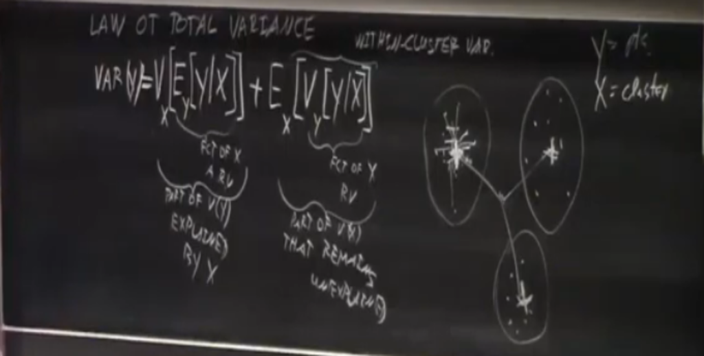
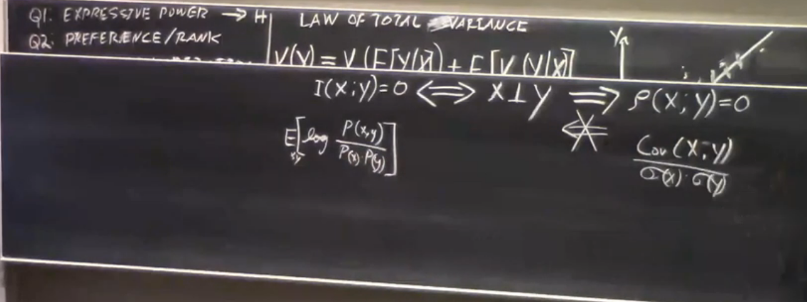
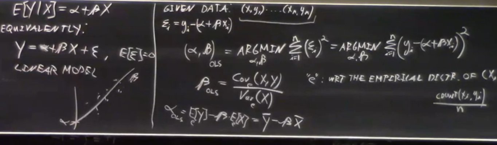
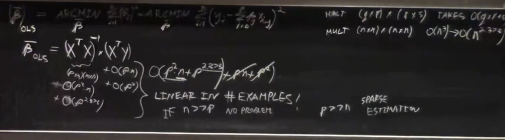
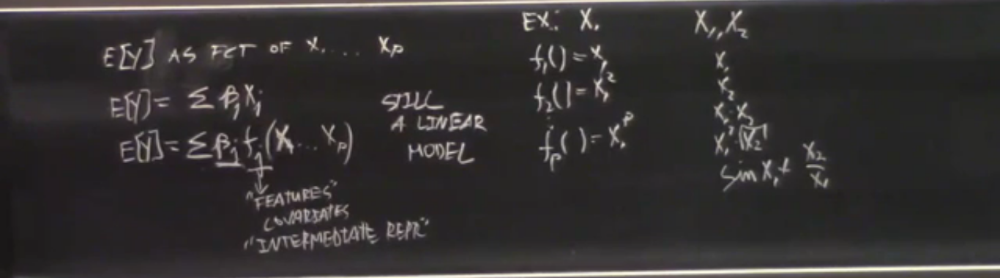
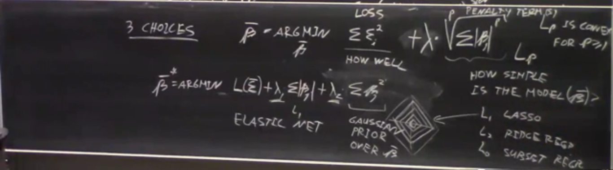
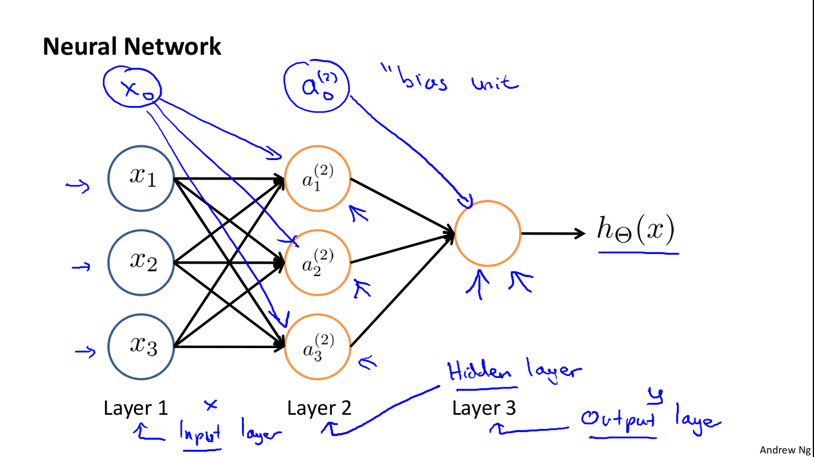
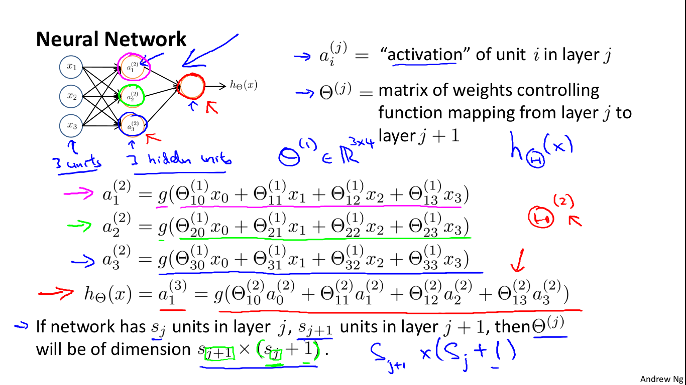

# Introduction to ML : 

ML is about learning a task **T** from experience/EXAMPLES **E** and get better at it by using the measure of performance **P**.

* Classification :

$$
f(PATIENT\_info) \rightarrow \{ CATEGORIES (D1, D2, D3) \}
$$

* Regression : 
  $$
  f(PATIENT\_info) \rightarrow \R
  $$

* Logistic Regression / Probability of something

$$
f(PATIENT\_info) \rightarrow [0,1]
$$

* Planning , or learning a route / plan :

$$
f(INPUT) \rightarrow plan
$$ { }

## Approaching a ML Problem

1. Consider your goal ->  definition of a task **T**

2. Consider the nature of available (or potential) experience **E**

3. Choose type of output **O** to learn from. (numerical? category? probability? plan?)

4. Choose the performance measure **P** (error / loss function)

5. Choose a representation for the input **X**

   * How many functions possible :     f: **D**omain -> **R**ange
     $$
     f = |R|^{|D|}
     $$

6. Choose a set of possible solutions **H** (hypothesis space)

   * Set of functions h:X->O
   * (Often by choosing a representation for them)

7. Choosing or design a learning algorithm.


## Example of ML problems : 

| INPUT    | OUTPUT       | NAME                | PERF<br />MEASURE                         |
| -------- | ------------ | ------------------- | ----------------------------------------- |
| ANYTHING | CATEGORICAL  | Classification      | [weighted]<br />Percentage of correctness |
| ANYTHING | R            | Regression          | ...                                       |
| ANYTHING | Proba. [0,1] | Logistic Regression | ...                                       |
| ANYTHING | PLAN         | Planning            | ...                                       |

 

## Inductive/Hard BIAS :

Choosing a small subset **H**:(hypothesis space) from **C** : (concept space)  - must be well chosen, this is done whenever we decide on the model representing our function  *f* -
$$
Hypothesis\ space\ H \in C;   \  |H| <<^{much\ less} |C| \\
Example : H = \{ All\ Conjunctions + the\ NULL\ VECTOR \}
$$


## Algo. FIND-S Algorithm : 

$$
how\ do\ we\ prove\ that\ the\ space\ H\ includes\ 1\ vector\ h \in H \subset C\\ 
h(X) = O
$$

Answer using the Find-S Algorithm :

```
1. initialize h to the most specific in H
2. for each training instance x
	for each attribute constraint ai in h
		if (constaint ai) in h is satisfied by X:
			do nothing;
		else :
			replace ai <- by the nest more general constaint that is satisfied by X
        end;
        
```


## Why does machine learning work :

**The inductive learning hypothesis** : any hypothesis found to approximate the target function well over a sufficiently large set of training examples will also approximate the target function well over other unobserved examples.

by selecting a hypothesis representation, the designer of the learning algorithm implicitly defines the space of all hypotheses that the program can ever represent and therefore learn.

## Algo. Explicit enumeration :

(visual space) V.S. 

V.S. (H, No Training Data) = H
V.S. (H, {data1})
V.S. (H, {data1, data2})
...

> testing against data and narrowing the H space into something acceptable in which you can choose one 'h' or take them all and add a function which test input on all of them and output the output given by the majority.


## BIAS :

* Representation / language /HARD BIAS :  creating a representation for our function f
* Soft / Ranking / Preference BIAS : Assuming a V.S. of our H and testing against data to shrink the H space  **(Explicit enumeration)**


# Information theory :

## To Read before anything :

[en.wikipedia.org/wiki/Mutual_information](https://en.wikipedia.org/wiki/Mutual_information)


## Information theory (by Claude Shannon): 

Change of view of the problem into try to learn *fct: X->Y*  :  using X to learn as much as i can about Y (as much as possible) error doesn't have to get reduced to 0.

### Introduction to the concept : 

Information = reduction in uncertainty

---

you have two outcomes one of them is gonna happen we don't know which and at some point we will find out which and the uncertainty will drop to 0

---

Information = surprised = Reduction in uncertainty
$$
Surprisal =  \{Information\ received\ in\ an\ experiment\ or\  observation\} \\= I(outcome) = log2(1/P(outcome))
$$
which gives as a way to quantify information.

. . .  
$$
Enropy[I(e)] = \sum^ep(e)*log2(1/q(e))\\
q : depends\ on\ the\ subject's\ probabilities
$$

### Implemented a decision tree from scratch : 

> Implemented a Decision tree from scratch!.
>
> link to The code : 
> https://github.com/Okimdone/Decision-Tree-Python


# Probability, Statistics Review:

## Small Summery :

* Random Variables
* Expectation/Mean of a Random variable : 
  * E[X] = SUM( x*P(x) )  ;; x in X;  
  * E[aX+bY+c] = a\*E[X] + b\*E[Y] + c                ; since aX+bY+c is a linear
  * E[X^2] >= (E[X])^2
  * For any convex f() : E[f(X)] >= f(E[X])    || JENSEN'S INEQUALITY 
* VARIANCE : VAR(X) , V(X) : 
  * V(X) = E[( X-E[X] )^2]
  * VAR[X] = E[X^2] - E[X]^2  >= 0
*  Standard deviation : 
  * sigma(X) = sqrt( V(X) )
* Covariance  :
  * COV(X, Y) = sigma(X, Y) = E[ ( X-E[X] ) (Y-E[Y]) ]
  * COV(X, Y) = E[XY] - E[X]E[Y]
  * COV(X, X) = VAR[X]


## Full Summery of Linear Models : 

[Probability, statitics, and linear Regression](https://www.cs.cmu.edu/~roni/10601-slides/ProbStats%20&%20Linear%20Regression.pdf)


# Linear Regression :

## The Law of total variance:

The figure bellow represents **Y** as the location of the point and **X** as the cluster it belongs to: 



In clustering, the first term is **the cross-cluster variance**, and the second term is **the within-cluster variance**.

In regression, the first term is **the explained variance**, and the second term is **the unexplained variance**.

A good clustering is a clustering that minimizes  the within cluster variance (**Vy[Y | X]**), and maximizes the cross cluster variance (**Vx[Ey[Y | X]]**), - the sum is fixed - 

This approach can generally be applied on numerical values for **Y**, or values with the notion of distance between them.


## Linear Correlation : 

[Click and check the document (page 3)!](https://www.cs.cmu.edu/~roni/10601-slides/ProbStats%20&%20Linear%20Regression.pdf)




Independent ⇒ uncorrelated

X,Y can be (linearly) uncorrelated, but still dependent!  (think of the case of distribution of points on the circumference of a circle).  Linear correlation measures only the extent to which X, Y are linearly related and not some other relationship between them.

## Linear Learning in One Dimension (Simple Linear Regression) :



[Click and check the document (chapter 3 page 4)!](https://www.cs.cmu.edu/~roni/10601-slides/ProbStats%20&%20Linear%20Regression.pdf)

P.S. : In the example, the calculating of Beta and alpha is due to the assumption / soft bias that Y has a Gaussian distribution around the Expected value for a given X.


## Linear Learning in Multiple Dimensions :

[Click and check the document (chapter 4 page 5)!](https://www.cs.cmu.edu/~roni/10601-slides/ProbStats%20&%20Linear%20Regression.pdf)

	

Shown in the picture is the Closed-form solution / Normal equation, that we can use when **n** is much bigger than **p** , when **X** is invertible.

is **x⁽T⁾ * x** always invertible (non-singular)?  Yes, as long as no feature is a linear combination of some other features, i.e. x is full column rank.  When **n >> p**, this is usually the case.  In that case, **x*= (x⁽T⁾ * x)⁽-¹⁾x⁽T⁾** is the left-inverse of x, in that **x* x= Id**.  This is a special case of a pseudo-inverse of a matrix.  (If some feature is a linear combination of other features, there is no unique solution, and we say that the corresponding **β**s are non-identifiable)

Even if **x⁽T⁾ * x** is invertible, we may prefer to calculate **x*** directly, because inverting a matrix can be numerically unstable.


## Sparse Estimation, and Regularization:

[Click and check the document (Last page)!](https://www.cs.cmu.edu/~roni/10601-slides/ProbStats%20&%20Linear%20Regression.pdf)


## What's a Linear Model and what's not :

 

The model in linear regression is called linear because it's linear in the parameters **β**s, so the model could be written as the sum of **β** * *f* (X¹, X² ...) , where *f* can be some fancy non linear function, if we do this this is still a linear model , which we can use to train our linear regression model. This is useful when trying to generate new features, like, if we believe that the output depends on the square of the temperature, that does not ruin our linear model, doesn't restrict as strongly what we think  are the true relationships between the input and the output.


## General form of a Linear Model :

  

Shown above is the general form of a linear model, which gives us generally 3 choices to choose from :

1. The hard bias : that is of the form of a Loss function : L(Ɛ), LOSS(Ɛ), (it was a ”ordinary least squares (OLS) solution" in the example shown above, based on the belief that )
2. the soft bias : that is of a form of a penalty term/regularization term(s), meaning how simple is our Model (shown on the very right)
3. and the **λ** : which defines how much effect does the soft bias play over our model : its value could be determined by doing a cross validation over our data simples (considering a value of **λ** and then train  the model on a subset of the dataset then testing with the rest ... until we find the value for which our model can fit the data).


**ELASTIC NET :** Having multiple Penalty terms, and extra choices / values for the **λ** to choose.


# Coursera thingies :

### Linear Regression with multiple variables :

#### Gradient decent with multiple variables :

(you need to choose the learning rate alpha, needs many iterations, works well even if n is very large)

Hypothesis : 
$$
h(\theta,x) = \theta^T*x
$$
Parameters : 
$$
\theta = [\theta0,\theta1,...\theta n]
$$
Cost/Performance function :
$$
J(\theta) = 1/2m \sum^{1,m}(h(\theta, x^{(i)}) - y^{(i)})^2
$$


Gradient Decent : 
$$
\theta 0 = \theta 0 - \alpha/m * \sum^{1,m}(h(\theta,x^{(i)}) - y^{(i)})\\
\theta j = \theta j - \alpha/m * \sum^{1,m}(h(\theta,x^{(i)}) - y^{(i)})x^{(i)}
$$

#### Normal equation :

(No need to choose alpha,  Don’t need to iterate.) but it's slow when n (number of features in the input) is very large : O(n**3)

$$
\theta = (X^TX)^{-1}X^Ty
$$


### Logistic Regression (for classification): 

enveloping  the h -hypothesis function- model from the linear regression with a sigmoid function : 
$$
h(\theta, x) = g(\theta^Tx)  = 1/(1+\exp(-\theta^Tx))
$$
 which makes : 
$$
0 <= h(\theta, x) <= 1
$$

##### Interpretation of the hypothesis output : 

h(theta, x) = estimated probability that y = 1 on input ,   Output = {0,1} , -binary classification -

Example :  h(theta, [x0, tumorSize]) = 0.7 =>  Tell patient that 70% chance of tumor being malignant 


### Decision boundary :

defining a threshold  for which we can say : 

* y = 1 , if h(theta, x ) >= 0.5
* y = 0, if h(theta, x) > 0.5


### Logistic regression cost function : 

$$
J(\theta) = 1/m \sum^{1,m} Cost(h(\theta, x^{(i)}), y^{(i)})\\
J(\theta) = -1/m [\sum^{1,m}y^{(i)}log(h(\theta,x^{(i)}))+ (1-y^{(i)})log(1-h(\theta,x^{(i)}))]
$$

and use gradient decent to minimize theta


## Neural Network Representation / BIAS : (non-linear hypotheses)

Algorithm that tries to mimic how the brain functions

### Non linear classification :

Example : (given an image (hight in px)\*(width in px) * (possible values for a pixel)  as features)  

classify if the image has a cat picture in it 

### we use the logistic sigmoid function as an activation function :






 Each neuron uses the sigmoid activation function to calculate its output value ( using **forward propagation**) 

and the last function h output using the same sigmoid function but taking as input the outputs calculated before a^i , 